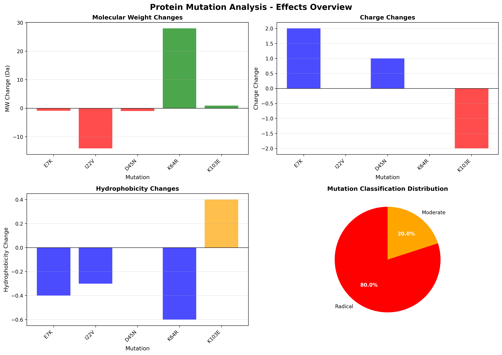

# Protein Mutation Analyzer

A Python-based bioinformatics tool for analyzing the effects of point mutations on protein properties.

## Overview

This tool predicts how single amino acid substitutions (point mutations) affect key protein characteristics:
- **Molecular weight** - Mass changes in Daltons
- **Electric charge** - Changes in net charge at pH 7
- **Hydrophobicity** - Changes in water affinity (Kyte-Doolittle scale)

Mutations are automatically classified as:
- 🟢 **Conservative** - Minor effects on protein properties
- 🟡 **Moderate** - Intermediate effects
- 🔴 **Radical** - Major effects potentially disrupting protein structure/function

## Features

✅ Load protein sequences in FASTA format  
✅ Analyze multiple mutations from CSV files  
✅ Calculate property changes with validation  
✅ Classify mutations by severity  
✅ Generate publication-quality visualizations  
✅ Export professional HTML reports  
✅ Built-in error checking and validation  

## Installation

### Prerequisites
- Python 3.8 or higher
- pip package manager

### Setup
```bash
# Clone the repository
git clone https://github.com/SimPet01/protein-mutation-analyzer.git
cd protein-mutation-analyzer

# Install dependencies
pip install -r requirements.txt
```

## Quick Start

### 1. Prepare your input files

**Protein sequence** (`data/my_protein.fasta`):
```
>sp|P02144|MYO_HUMAN Myoglobin
MGLSDGEWQLVLNVWGKVEADIPGHGQEVLIRLFKGHPETLEKFDKFKHLKSEDEMKASED
```

**Mutations** (`data/my_mutations.csv`):
```csv
position,original_aa,mutant_aa,description
7,E,K,Glutamic acid to Lysine - charge reversal
22,I,V,Isoleucine to Valine - conservative
```

### 2. Run the analysis
```bash
cd scripts
python analyzer.py
```

### 3. View results

The tool generates three output files in the `output/` directory:
- `mutation_analysis.csv` - Detailed results table
- `mutations_visualization.png` - Four-panel visualization
- `mutation_report.html` - Interactive HTML report

## Project Structure
```
protein-mutation-analyzer/
├── README.md                    # Project overview (you are here)
├── USAGE.md                     # Detailed usage guide
├── requirements.txt             # Python dependencies
├── data/                        # Input files
│   ├── example_protein.fasta
│   ├── mutations_example.csv
│   ├── test_protein.fasta
│   └── test_mutations.csv
├── scripts/                     # Python code
│   ├── analyzer.py              # Main analyzer class
│   └── test_analyzer.py         # Testing script
└── output/                      # Generated results
    ├── mutation_analysis.csv
    ├── mutations_visualization.png
    ├── mutation_report.html
    ├── test_mutation_analysis.csv
    ├── test_mutations_visualization.png
    └── test_mutation_report.html
```

## Usage Examples

### Basic Usage
```python
from analyzer import ProteinMutationAnalyzer

# Initialize with protein sequence
analyzer = ProteinMutationAnalyzer('../data/example_protein.fasta')

# Load mutations
analyzer.load_mutations('../data/mutations_example.csv')

# Perform analysis
results = analyzer.analyze_all_mutations()

# Generate outputs
analyzer.save_results()
analyzer.visualize_mutations()
analyzer.generate_html_report()
```

### Programmatic Access
```python
# Access results DataFrame
results_df = analyzer.results_df

# Filter specific mutations
radical_mutations = results_df[results_df['classification'] == 'Radical']

# Get specific properties
charge_changes = results_df['charge_change']
```

## Mutation Classification Logic

The tool uses the following criteria to classify mutations:

| Classification | Criteria |
|---------------|----------|
| **Conservative** | MW change < 5 Da AND no charge change AND hydrophobicity change < 0.5 |
| **Radical** | MW change > 20 Da OR charge change ≠ 0 OR hydrophobicity change > 1.5 |
| **Moderate** | Everything in between |

## Scientific Background

### Amino Acid Properties

The analyzer uses established biochemical scales:

- **Hydrophobicity**: Kyte-Doolittle scale
  - Positive values = hydrophobic (water-avoiding)
  - Negative values = hydrophilic (water-attracting)

- **Charge**: At physiological pH (7,0)
  - Basic residues (K, R, H): +1
  - Acidic residues (D, E): -1
  - Others: 0 (neutral)

- **Molecular Weight**: Standard amino acid masses (Da)

### Amino Acid Grouping

| Group | Residues | Properties |
|-------|----------|------------|
| Hydrophobic | A, V, I, L, M, F, W, P | Nonpolar, often buried in protein core |
| Polar | S, T, C, Y, N, Q | Uncharged but interact with water |
| Charged+ | K, R, H | Positively charged (basic) |
| Charged- | D, E | Negatively charged (acidic) |
| Special | G | Smallest, most flexible |

## Example Output

### Visualization


*Four-panel analysis showing molecular weight, charge, and hydrophobicity changes, plus classification distribution.*

### HTML Report
The HTML report provides an interactive, color-coded table viewable in any web browser.

## Testing

Run the test suite with alternative data:
```bash
cd scripts
python test_analyzer.py
```

This validates the analyzer with a different protein sequence and mutation set.

## Dependencies

- **biopython** (1.81) - Sequence parsing and protein analysis
- **pandas** (2.0.0) - Data manipulation and CSV handling
- **matplotlib** (3.7.0) - Visualization generation
- **numpy** (1.24.0) - Numerical operations

See `requirements.txt` for complete list.

## Documentation

- **README.md** - This file, project overview
- **USAGE.md** - Comprehensive usage guide with examples
- **Code documentation** - Inline docstrings following Python standards

## Limitations

- Currently supports only single point mutations (not insertions/deletions)
- Predictions are based on physicochemical properties, not structural modeling
- Does not account for protein context (local structure, interactions)
- Charge calculations use simplified pH 7,0 model

## Future Enhancements

Potential improvements for future versions:
- [ ] Integration with AlphaFold for structural context
- [ ] Support for multiple mutation combinations
- [ ] Machine learning-based severity prediction
- [ ] Batch processing of multiple proteins
- [ ] Web interface for non-programmers
- [ ] Integration with protein databases (UniProt, PDB)

## Contributing

This is a personal learning project created for bioinformatics portfolio development. 
Suggestions and feedback are welcome!

## License

This project is open source and available for educational and research purposes.

## Author

Created as part of bioinformatics skill development and job application portfolio.

**Contact**: karelDOTcurinaATseznamDOTcz

## Acknowledgments

- BioPython community for excellent biological sequence tools
- Kyte & Doolittle for the hydrophobicity scale
- Swiss-Prot/UniProt for protein sequence data standards

---

**Note**: This tool is for research and educational purposes. For clinical or production use, 
additional validation and testing would be required.